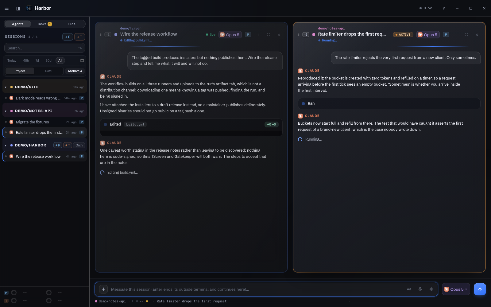
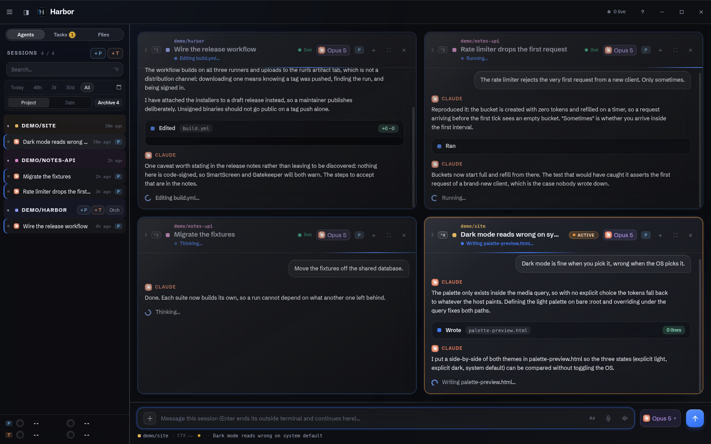
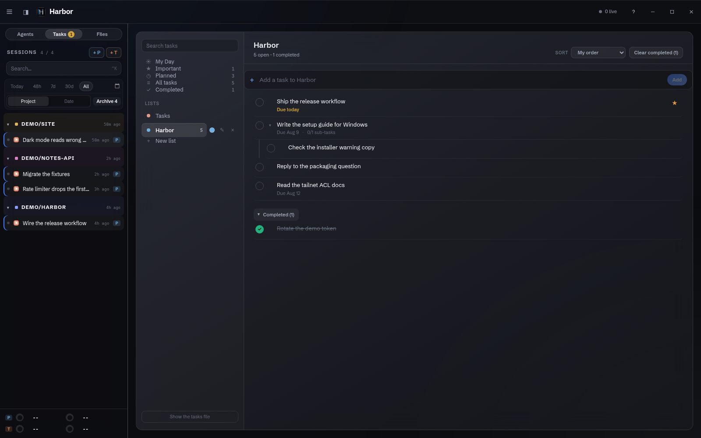
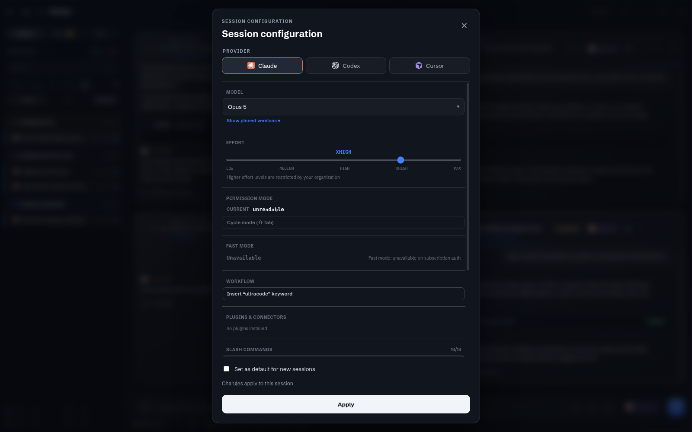

# Harbor

A Linux desktop application for running and monitoring several Claude Code
sessions at once. It also drives OpenAI Codex and Cursor CLI sessions from the
same interface.

The main surface is **not a terminal**. A session rail lists your projects and
their sessions; opening one shows it as a designed **conversation window**,
parsed live from the session's own `~/.claude/projects` JSONL transcript, on a
free-form stage that holds up to sixteen open windows at once. One universal
command bar at the bottom drives whichever window is selected. Every window
has a `>_` toggle that flips it to a real xterm.js terminal attached to that
session's pty, for when you need the pty itself (for example, to answer a
permission prompt).

Because conversations render from transcripts rather than from a pty, Harbor
can show you sessions that are running **outside** it. Typing into one adopts
it into Harbor.



<table>
<tr>
<td width="50%"><a href="docs/screenshots/grid.png"></a><br><sub><b>The adaptive grid.</b> One window is full width, two split, and beyond that an equal-cell grid up to sixteen. Drag a window header to rearrange.</sub></td>
<td width="50%"><a href="docs/screenshots/tasks.png"></a><br><sub><b>Tasks.</b> A personal list, separate from anything an agent writes on its own. Agents can drive it through the <code>harbor-tasks</code> CLI, but only when you ask.</sub></td>
</tr>
<tr>
<td width="50%"><a href="docs/screenshots/session-config.png"></a><br><sub><b>Per-session capability.</b> Provider, model, effort, permission mode, plugins and slash commands, read from what you actually have. Nothing here is faked when it cannot be read.</sub></td>
<td width="50%" valign="top"><sub><b>About these images.</b> They are captured by <code>app/scripts/capture-screenshot.js</code> from a synthetic corpus, in a fully isolated Harbor with its own config, caches, session store, daemon and <code>HOME</code>. Every project, session and task in them was invented for the capture; none of it exists outside that run. You can regenerate them yourself with <code>node scripts/capture-screenshot.js</code> from <code>app/</code>.</sub></td>
</tr>
</table>

## Requirements

- **Node.js 22 or newer.** The build fails on Node 20 with an error that names
  a module rather than the version, so check this first.
- **The Claude Code CLI on your `PATH` and signed in.** Optionally the Codex
  and/or Cursor CLIs too; each one Harbor cannot find is simply disabled.
- That is the whole list. [Herdr](https://herdr.dev) is **optional**: Harbor's
  own session daemon is the default backend and needs no separate install.
  Herdr 0.7.4 is only required if you deliberately select it with
  `HARBOR_SESSION_BACKEND=herdr` (see Architecture below).

Platform status, stated plainly because it is the first thing worth knowing:

| Platform | Status |
| --- | --- |
| **Linux** | The platform Harbor is developed on. The unit suite, a two-run Electron end-to-end gate and a two-run mobile gate all run here. |
| **Windows** | The session daemon, spawning a session, sending input, reading the screen and closing a session are proven on real hardware. **The Electron window itself has never been opened on Windows**, and part of the unit suite still fails on POSIX assumptions. |
| **macOS** | Never run on a Mac. Every darwin code path is unit-tested against an injected adapter on Linux, which is not the same thing. `setup/macos/README.md` is a validation checklist rather than a support document. |

If you run it somewhere it has not been validated and it breaks, an issue
naming what you did and what happened is genuinely useful.

## Install

### Download a build

Pushing a `v*` tag builds installers for Linux (`.AppImage`, `.deb`), Windows
(`.exe`) and macOS (`.dmg`) and attaches them to a **draft** GitHub release,
which a maintainer then publishes by hand. So [the releases page](../../releases)
is empty until somebody has done that, and if it is empty, build from source
below. The draft step is deliberate: these are unsigned binaries and nobody
should be able to publish them by pushing a tag alone.

**They are not code-signed**, because nobody has bought a Windows Authenticode
certificate or an Apple Developer ID for this project, so each OS will warn you:

- Windows: SmartScreen says "Windows protected your PC". More info, then Run anyway.
- macOS: right-click the app and choose Open, or
  `xattr -dr com.apple.quarantine /Applications/Harbor.app`.
- Linux: `chmod +x` the AppImage first.

Building from source is the path with the most coverage behind it, and it is
what the platform table above describes.

### Build from source

All commands run from `app/`:

```sh
cd app
npm install       # also installs the session daemon's own native dependency
npm run build     # builds the renderer into app/dist/; required before npm start
npm start         # launch the app
```

`npm install` matters more than it looks: the session daemon runs under the
system Node rather than under Electron, so its dependencies live in
`app/src/daemon/package.json` and are installed by a `postinstall` hook. If
sessions will not start, that is the first thing to check.

`npm start` loads `app/dist/index.html` over `file://`, so a build has to exist
first. During development, `npm run dev` runs a Vite dev server instead and
needs no prior build.

Per-platform notes, including what is unproven on each, are in
[`setup/README.md`](setup/README.md).

The app is single-instance: a second launch focuses the existing window rather
than opening a duplicate.

The first launch opens a first-run setup wizard, described below, because
there is no configuration yet.

## The four views

A view switcher at the top of the rail swaps the main pane between four
surfaces, and the choice persists across restarts:

- **Agents**: the stage of open conversation windows, described above. This is
  where you spend most of your time.
- **Tasks**: a personal to-do list, entirely separate from anything an agent
  writes on its own. Agents can read and edit it through the `harbor-tasks`
  CLI, but only when you ask.
- **Orch**: per-project orchestration queues. Kick off a research or execution
  run against a project and watch it as a pane. This one needs a **delegation
  queue CLI that Harbor does not ship**; the setup wizard looks for one, says so
  when it cannot find it, and defaults the whole tab off, in which case it does
  not appear at all. What the shipped `/orchestrate-*` commands expect is
  written up in [`docs/COMMANDS.md`](docs/COMMANDS.md).
- **Files** (internally "Artifacts"): files your agent sessions have produced,
  discovered from their transcripts rather than a filesystem sweep, and
  rendered inline (images, PDFs, HTML, video) rather than opened externally.

## The phone client

Harbor also ships a mobile web client: an installable PWA (source in
`app/web/`, built with `npm run build:web` into `app/dist-web/`) served by a
separate, headless Node server (`app/src/server/`, started with
`npm run start:server`).

**There is no app store here.** "Installing" the phone client means running its
server yourself and adding the page to your home screen; it is a self-hosted
surface, not a download, and it is the one of the four platforms that asks
something of you before it works.

**It runs on your own machine.** The server has to sit alongside the session
daemon, which has to sit alongside your code, so "the server" is whatever
computer you already run your agents on: a laptop is fine. A second, always-on
machine is an *option*, not a requirement, and the only thing it buys you is
that the phone keeps working while your laptop is asleep. If you want that, the
sessions live on that machine too, which is the part that is easy to get wrong.
Both arrangements, and how to keep the server running after you close the
terminal, are in [`setup/mobile.md`](setup/mobile.md).

The security posture, in short (full detail in `docs/SECURITY-MOBILE.md`):

- The server binds only to loopback and to a Tailscale address
  (`100.64.0.0/10`); binding to any other address, or to `0.0.0.0`, is
  rejected at startup. Tailscale Funnel (which would expose the service on the
  public internet) is not used; the model assumes tailnet-only access. Loopback
  alone works without Tailscale, which is enough to try it from a browser on the
  same machine but not from a phone.
- Every RPC method is classified as `mutating`, `remote-safe`, or
  `local-only`. Mutating methods (starting a session, sending a message,
  answering a dialog, killing a worker, and so on) require a 64-character
  bearer token generated on first start and stored at `<userData>/server-token`
  with `0600` permissions. Token comparison is constant-time.
- `local-only` methods are refused outright over the network, regardless of
  token.
- Served files are restricted to an index and refuse anything outside it:
  artifacts to an index built from agent transcripts, project icons to a
  listing of the one configured icon directory. Path traversal, symlink
  escapes, and encoding tricks are refused in both cases.

This is a loopback-or-Tailscale, token-authenticated remote surface, not a
public one. Read [`docs/SECURITY-MOBILE.md`](docs/SECURITY-MOBILE.md) before
exposing it to any network you do not fully trust, and
[`setup/mobile.md`](setup/mobile.md) for the actual steps.

## Configuration and the setup wizard

First launch opens a seven-step wizard that writes your own
`config.json` (`~/.config/harbor/` on Linux, `%APPDATA%\harbor\` on Windows,
`~/Library/Application Support/harbor/` on macOS). **Harbor ships no accounts,
no workflows and no paths of anybody else's**: every field it shows is
something it actually detected on your machine, nothing is pre-filled with a
plausible-but-wrong value, and every field is editable:

1. **Welcome**: your OS, home folder, which agent CLIs it found on your
   `PATH`, and Herdr if you have it (optional, and leaving it blank is a
   supported answer: Harbor's own session daemon is the default backend).
2. **Claude plans**: one entry per Claude config home (a folder holding that
   account's `.claude.json`), with the signed-in email shown next to each.
   You can add more than one, for example a personal account and a work
   account, and Harbor shares one transcript index across all of them.
3. **Codex and Cursor**: enables whichever of those CLIs were detected.
4. **Commands**: reads back your actual skills and slash commands so the
   command bar's capability menu reflects what you really have.
5. **Shared config**: optional, symlinks selected settings across config
   homes.
6. **Orchestration**: optional, and off by default unless it finds a
   delegation queue CLI on your `PATH`. Controls whether the Orch view appears
   at all.
7. **Defaults**: what a new session launches with (provider, model, effort),
   then a review screen before it writes the config.

No step can be skipped into a dead end; a screen that will not advance shows a
field-level reason why. You can reopen the wizard at any time from the app
menu, and it opens on what you chose last time rather than resetting to what it
detects: your ids, labels, badge colours, default account and new-session
defaults are yours, while whether a binary is present and which account a home
is signed into are re-read fresh, because those are facts about the machine
rather than decisions. Finishing the wizard restarts Harbor onto the config it
just wrote.

Every key in that file is documented in
[`docs/CONFIGURATION.md`](docs/CONFIGURATION.md), including the ones the wizard
does not surface, so hand-editing is a supported path rather than a guess.

## Architecture in brief

Three-process Electron layout: `app/src/main/` (Node/Electron main process,
all IPC handlers), `app/src/preload/` (a typed `window.harbor` bridge, no
`nodeIntegration`), and `app/src/renderer/` (React 19, the rail/stage/command
bar UI). `app/src/shared/` holds logic used by both the renderer and the
main/test side.

Conversation windows render from each session's transcript on disk
(`~/.claude/projects/**/*.jsonl` and the equivalent Codex and Cursor stores),
so a window can show a session Harbor is not currently driving. Driving a
session (the pty itself, used for the `>_` terminal view and for delivering
what you type) goes through a pluggable session backend, selected by the
`HARBOR_SESSION_BACKEND` environment variable:

| Value | Backend |
|-------|---------|
| unset, or `sessiond` (default) | Harbor's own pty daemon, at `app/src/daemon/`, controlled through `bin/harbor-sessiond` |
| `herdr` | [Herdr](https://herdr.dev) 0.7.4, a third-party terminal multiplexer daemon that Harbor drives but never forks or replaces |

Any other value refuses to start. Switching backends is not seamless: it drops
every live pty (conversation history is unaffected, since it lives in the
transcripts, and dead sessions resume by session id), so treat a switch as
"restart Harbor, reopen sessions from the rail."

`bin/` holds a set of scripts usable outside the GUI: `claude-sessions`
(an fzf-based session picker; symlink it onto your `PATH` as `hist` if you
want it there, nothing in the repo does that for you), `ai` (a new-session
launcher), `harbor-tasks` (the Tasks view's command line), and
`herdr-server-clean` / `herdr-health.sh` (the only sanctioned way to start and
health-check a Herdr daemon, when using the Herdr backend).

Further reading: `docs/HANDBOOK.md` (the "why" behind each subsystem, and what
its guarantee has to look like on a platform Harbor was not built on),
`docs/ARCHITECTURE-v2.md` (daemon plumbing predating the current renderer),
and `docs/SESSION-DAEMON-CUTOVER.md` (the session backend cutover in more
detail).

## Testing

All commands run from `app/`:

```sh
npm test              # node scripts/test.js: every test/**/*.test.js file
npm test -- herdr      # filter test files by path substring
npm run test:e2e       # build, then a Playwright Electron suite run TWICE; both runs must be green
```

`npm run test:e2e` (and the other verification scripts under `app/scripts/`)
always run under `xvfb-run` with the display scrubbed, so test windows never
open on a real desktop. Tests never touch your live Herdr daemon or your real
session store; the suites that need a daemon spawn their own in an isolated
named session, on their own socket and directories.

Two things about `npm test` are worth knowing before you run it, because both
look like the project being broken when they are not:

- **Four files under `test/herdr/` need the Herdr CLI on your `PATH`**
  (`bridge`, `control-latency`, `pane-size`, `worker-close.integration`): they
  drive a real daemon end to end. Herdr is optional for *running* Harbor, but
  not for running those four. Without it they fail after a timeout. Everything
  else passes without it. (`npm test -- <substring>` is a positive filter, so
  `npm test -- herdr` runs *only* that block; there is no flag that runs
  everything except it.)
- **A handful of specs still read your real `$HOME`** and assert against
  whichever `~/.claude*` config homes happen to exist on the machine, so they
  pass on a machine with two configured Claude accounts and fail on one with
  none. That is a defect in those specs, not in the code under test, and it is
  tracked rather than hidden: see `docs/BACKLOG.md`.

## Troubleshooting

**Point your AI coding agent at [`AGENTS.md`](AGENTS.md).** It is a reference
written for exactly that: how to discover what you already have (config homes,
accounts, which CLIs), every configuration key and environment variable and what
each one is for, how to verify each moving part separately, and what the known
failure shapes are with the reasoning behind each fix. Harbor was developed on
one Linux machine and yours is different; that document exists because that is
the normal case, not an edge case.

A few of the most common cases are inlined below.

**Degraded-daemon banner.** Shown when the selected session backend cannot be
reached, or (for the Herdr backend) when the daemon's protocol version does
not match what Harbor expects. If you are on the Herdr backend, Harbor
auto-starts the daemon via `bin/herdr-server-clean`; if auto-start fails, run
it manually:

```sh
bin/herdr-server-clean &
```

Then reload the app.

**Electron GPU / compositor issues.** If the window renders blank or with
visual artifacts:

```sh
cd app && npm start -- --disable-gpu
```

**Sessions missing from the sidebar.** The session index runs on every app
open. If a very recent session does not appear immediately, give it a few
seconds; it self-heals rather than requiring a restart, because a brand-new
session may not have written its transcript yet.

## How this was built

Harbor was written with heavy AI assistance, using Claude Code, which is also
the tool it exists to drive. That is said here rather than left to be found, and
`CLAUDE.md` is the working instruction file, kept in the repository because it
doubles as the most accurate record of why the code is shaped the way it is.

**This repository starts from a single commit, and that is deliberate.**
Development happened in a private repo whose history is not published, because
its early commits contain transcripts of real working sessions: client names,
colleagues, and business content belonging to people who never agreed to be in a
public repository. Squashing was the only way to publish the code without
publishing them. The trade is real and worth stating plainly: you lose the
commit-by-commit history, which for a project like this was genuinely good
evidence. `CLAUDE.md` and `docs/BACKLOG.md` are what survive of it, and they are
detailed for exactly that reason.

Being specific about what that does and does not mean, because the phrase
covers a wide range:

- `CLAUDE.md` and the commit log are an **incident log**, not a design
  document written up front. Nearly every rule in them exists because
  something broke on a real machine, and says what broke. A representative
  entry: the session daemon reported thirteen sessions as running after a
  reboot, because a keeper is SIGKILLed before it can write its exit stamp,
  and the fix keys on the boot rather than the pid because pids are reused.
- The suite is unit tests plus two end-to-end gates that must each pass twice
  in a row, some driving a real pty. The gates that matter were written
  *after* a bug got past the ones that came before, which is also why several
  of them assert what a person would see rather than what the DOM contains.
- Linux is the only platform validated end to end. That is in Requirements
  above rather than in a footnote, and the known gaps on the other two are
  written down in `setup/windows/README.md` and `setup/macos/README.md`
  instead of being left for you to discover.

If something is broken, an issue naming what you did and what happened is the
most useful thing you can send.

## Contributing

There is no separate contributing guide yet; the bar for a change is that
`npm test` and `npm run test:e2e` (from `app/`) stay green *relative to what
they did before your change*, which is not the same as "all green". See the two
known exceptions in Testing above, both of which fail for reasons that have
nothing to do with your patch. `CLAUDE.md`
at the repository root and `docs/HANDBOOK.md` describe the conventions and
the reasoning behind them in detail; read those before making a structural
change.

## Licence

Harbor is licensed under the [MIT License](LICENSE). See [NOTICE](NOTICE) for
third-party trademarks referenced in the interface, third-party material
bundled in this repository, and a pointer to `docs/THIRD-PARTY.md` for the
licenses of the npm packages Harbor depends on at runtime.

Harbor never modifies the contents of a Claude Code transcript. It reads
`~/.claude/projects/` and renders from it; nothing it does appends to, rewrites
or truncates a transcript file, so a session's history is never something Harbor
can corrupt.

Two things it can do to that directory, both only when you ask for them
explicitly, and both reversible:

- **Deleting a session** from the rail's context menu *moves* that one `.jsonl`
  into `~/.local/share/harbor/trash/`. It is not unlinked.
- **The setup wizard's optional "Shared config" step** can make one account's
  `projects` directory the shared one, which replaces the others with a symlink.
  The real directory it replaces is renamed to `<path>.harbor-backup` first,
  never deleted. Skipping that step, which is the default, leaves every config
  home untouched.

Short of those two, uninstalling Harbor leaves every transcript exactly where it
was.
